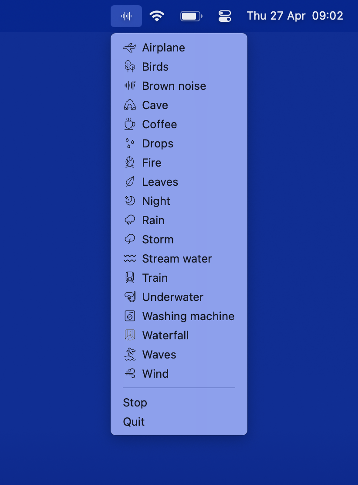

# Noise Bar

Noise Bar is a minimal MacOS utility to listen to brown noise or nature sounds that help you relax or concentrate.

The sounds and icons are sourced from the [Noisekun](https://github.com/mateusfg7/Noisekun) project.
